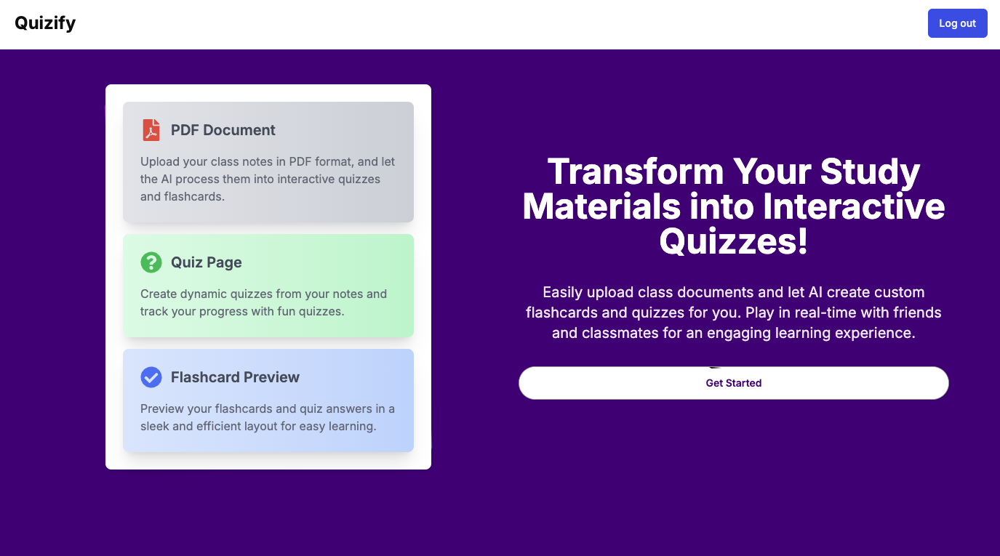
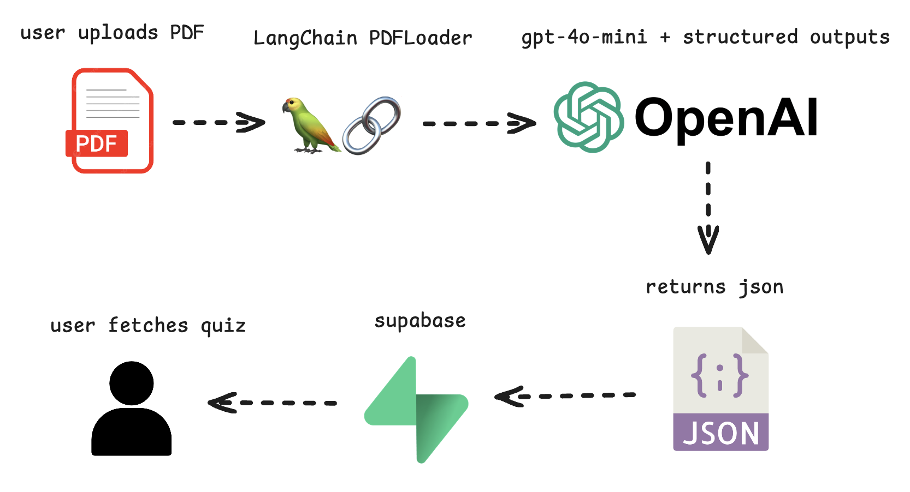

# Quizify



### CUNY Queens College Knight Hackathon Fall 2024

**Developed by:** Daniel, Ahmad, Samiha, and Mahamud

[Devpost Project Page](https://devpost.com/software/quizify-es9ori)

## Demo Video

<div align="center">
  <a href="https://youtu.be/u1ulyAsBHTA?si=RB8Ur6m9nZu_6vdL">
    
  </a>
</div>


## Project Overview
### Inspiration
Many students face challenges organizing and processing large volumes of study material, particularly when preparing for exams. Traditional study methods, like reviewing static documents, can be repetitive and less engaging, often leading to poor retention.

**Quizify** addresses this by using AI to transform uploaded class documents (e.g., PDFs) into interactive quizzes and flashcards, making study sessions more engaging and effective.

### What it does
- **Interactive Learning:** Converts uploaded study documents into personalized quizzes and flashcards.
- **Customized Focus:** Generates quizzes tailored to each user's study material, helping to highlight key concepts and improve retention.

## How We Built It
### Tech Stack
- **Frontend:** Next.js, React
- **Backend:** Next.js, TypeScript
- **Database:** Supabase (PostgreSQL)
- **AI Integration:** OpenAI + LangChain (using the GPT-4o-mini model with structured outputs)

## System Diagram


### Key Features
- **Upload Documents:** Users can upload class notes or study material.
- **AI Quiz Generation:** AI processes the material and generates quizzes and flashcards.
- **User-Friendly Interface:** Built with Next.js for fast and responsive performance.

## Challenges We Faced
- **Authentication Issues:** Integrating user authentication with Supabase presented some challenges and required additional troubleshooting.
- **New Technologies:** Some team members were new to tools like Next.js and LangChain, which required time to learn and adapt.

## Accomplishments
- **Functional Web Application:** Successfully built and launched Quizify within the hackathon timeframe.
- **AI-Powered Interactivity:** Integrated OpenAI capabilities to create interactive and effective study tools.

## Lessons Learned
- **Collaboration:** Enhanced teamwork skills through effective communication and support.
- **Technical Growth:** Gained practical experience in Next.js, LangChain, and Supabase, broadening our technological proficiency.

## What's Next for Quizify
- **Real-Time Quiz Mode:** Implement a real-time mode for students to take quizzes collaboratively with friends or classmates.
- **Group Study Support:** Facilitate group study sessions and friendly competitions to increase engagement and knowledge retention further.

## How to Run the Project
First, run the development server:

```bash
npm run dev
# or
yarn dev
# or
pnpm dev
# or
bun dev
```

Open [http://localhost:3000](http://localhost:3000) with your browser to see the result.
